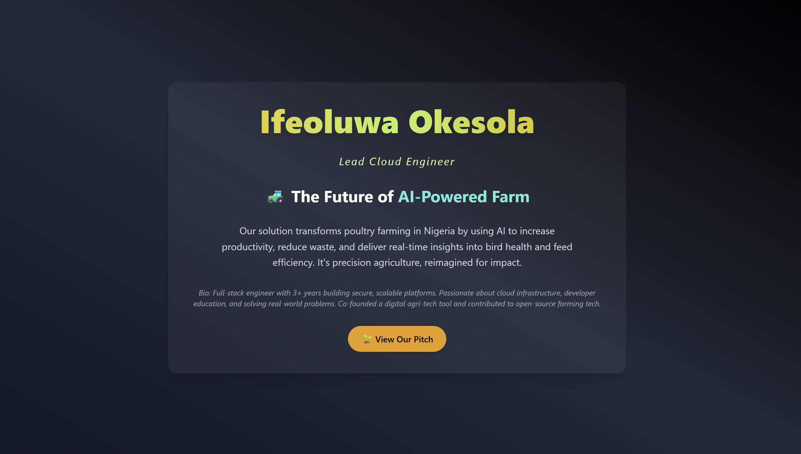

# AI-Powered Poultry Farming

## 🌐 Live Demo
**Public IP**: [http://34.246.163.41/](http://34.246.163.41/)

## 📘 Project Objective

This project was built as part of the AltSchool of Engineering second semester cloud engineering assignment. The objective is to:

- Provision a cloud server
- Set up a production-ready web server (with reverse proxy)
- Deploy a dynamic landing page that communicates a startup idea
- Secure the server using best practices 
- Document the process for technical review

---


## 🚀 Project Overview
A personalized dynamic landing page built to showcase a startup idea:  
**“The Future of AI-Powered Farm”**
It presents:
- My name & role
- The startup pitch
- A professional bio
- Simple styling with Tailwind CSS

### 👨‍💻 Lead Developer
**Ifeoluwa Okesola – Full Stack Engineer**

## 💡 Project Pitch
We redefine poultry farming in Nigeria by leveraging AI to boost productivity, reduce waste, and monitor real-time health metrics — helping farmers make data-driven decisions.

## 🧠 Bio
A full-stack engineer with over 3 years of experience building scalable applications. Experienced in backend and frontend technologies. Currently part of the Tech4Dev Developer Foundry Fellowship and undergoing cloud engineering course with AltSchool Africa.

## 🔧 Stack & Tools
- Ubuntu (on EC2)
- Termius for SSH client for server access
- Node.js + Express.js
- Nginx as reverse proxy
- PM2 for Node process manager
- Tailwind CSS for styling
- GitHub for version control

## 🛠 Step-by-step process

### ✅ Server Provisioning
- Created an EC2 instance on AWS (Ubuntu)
- Generated and downloaded a key pair (`.pem` file)
- Connected to the instance using **Termius SSH**
- Opened ports: 80 (HTTP) and 443 (HTTPS)

### ✅ Installed NodeJs
```bash
curl -fsSL https://deb.nodesource.com/setup_18.x | sudo -E bash -
sudo apt install -y nodejs
```

### ✅ Installed and Configured Nginx
```bash
sudo apt update
sudo apt install nginx
sudo systemctl enable nginx
sudo systemctl start nginx
```
### ✅ Edited the Nginx config to reverse proxy requests to the Node.js app
```bash
sudo nano /etc/nginx/sites-available/default
```
Restarted the Nginx after updating the location block

```bash
sudo systemctl restart nginx
```

### ✅ App Setup
- Initialized project
```bash
mkdir my-startup && cd my-startup
npm init -y
npm install express
```
- Created index.js
- Created a public/index.html and added landing page content

### ✅ App Deployment
- Node App is made persistent with PM2

```bash
sudo npm install -g pm2
pm2 start index.js
pm2 save
pm2 startup
```
- Node.js app serves landing page from `/public/index.html`
- Nginx configured as a reverse proxy to Node.js

### ✅ Screenshot of Rendered Page




## 📂 Project Structure
```
├── public/
│ └── index.html
├── index.js
├── package.json
├── README.md

```

---

## 🙌 Acknowledgements
Built as part of the AltSchool Africa Cloud Engineering program.  
Grateful for the guidance from mentors and the support of the Dev community.

📫 Reach me: [LinkedIn](https://www.linkedin.com/in/ifeoluwa-okesola-128584252/)

